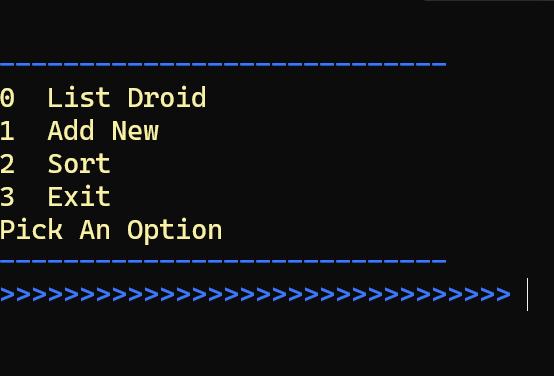

## Description
<<<<<<< HEAD
This software serves as a comprehensive management system for Star Wars droids utilized by a shipping company. The system is pre-loaded with eight test droids, featuring two of each type. Users have the capability to add droids by type and customize various options associated with each droid. The program offers sorting functionality based on two criteria: model and total cost.

Sorting by model employs a bucket sort algorithm. Droids are removed from their respective stacks and enqueued onto a droid queue. The original droid array is then updated with the sorted droids.

For sorting by total cost, a modified merge sort is utilized. The algorithm creates an auxiliary array and iterates through both arrays, ensuring each part is correctly ordered. Empty spots are prioritized at the beginning if no data exists. Subsequently, the sorted arrays are merged, and the existing droid array is overwritten for final output to the user.
#Images

=======
This program manages Star Wars droids for a shipping company. I have put in 8 different test droids 2 of each type. This droid allows you to add droids by type and then select any options related to that droid. The droids can be sorted by either model or total cost. Sorting by model uses a bucket sort. The droids are popped off their respective stacks and enqueued onto the droid queue. The original droid array is then overwritten with the sorted droids. The sort by total cost option uses a modified merge sort. The sort  method first creates an aux array and then loops through both arrays until each part is in the correct order empty spots will be put at the beginning if there is no data. Finally, the sort will merge the arrays back together and overwrite the existing droid array for the final output to the user. Unit testing was used throughout the project to test if test data was added to the array and if the droids were sorted correctly. 
>>>>>>> 9a54e73deea3ef37110d204cc2f8a8c1d2911d8e

